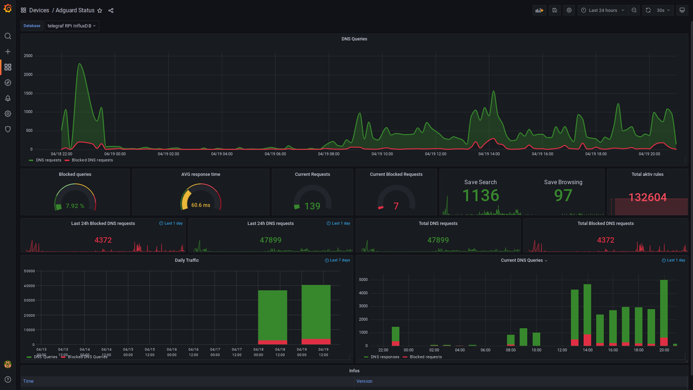

# adguard2influxdb

Adguard to InfluxDb is a tiny daemon written in python to fetch data from the Adguard DNS and writes it to influxdb.
It is equal capable as adguardhome and directly writing to influxdb.

# Grafana

Use ```grafana_dashboard_adguard.json``` to import this dashboard.



# Requirements
* python3.6 or newer
* influxdb
* adguardhome >= 0.4.2

# Setup
* here we assume we install in ```/opt```

## Ubuntu 18.04
```
sudo apt-get install virtualenv python3-lxml
cd /opt
git clone https://github.com/Friedjof/adguard2influxdb.git
cd adguard2influxdb
virtualenv --system-site-packages -p python3 .venv
. .venv/bin/activate
pip3 install -r requirements.txt
```

## RHEL/CentOS 7 with EPEL
```
yum install git python36-virtualenv python36-lxml
cd /opt
git clone https://github.com/Friedjof/adguard2influxdb.git
cd adguard2influxdb
virtualenv-3 --system-site-packages .venv
. .venv/bin/activate
pip3 install -r requirements.txt
```

* modify your configuration and test it
```
chmod 755 ./adguard2influxdb.py
./adguard2influxdb.py
```

## Install as systemd service
Ubuntu
```
cp /opt/adguard2influxdb/adguard2influxdb.service /etc/systemd/system
```
RHEL/CentOS
```
sed -e 's/nogroup/nobody/g' /opt/adguard2influxdb/adguard2influxdb.service > /etc/systemd/system/adguard2influxdb.service
```

```
systemctl daemon-reload
systemctl start adguard2influxdb
systemctl enable adguard2influxdb
```

## Run with Docker
```
git clone https://github.com/Friedjof/adguard2influxdb.git
cd adguard2influxdb
```

Copy the config from the [example](adguard2influxdb.ini-sample) to ```my-adguard2influxdb.ini``` and edit
the settings.

Now you should be able to build and run the image with following commands
```
docker build -t adguard2influxdb .
docker run -d -v $PWD/configuration.ini:/app/configuration.ini --name adguard2influxdb adguard2influxdb
```

You can alternatively use the provided [docker-compose.yml](docker-compose.yml):
```
docker-compose up -d
```
If you're running the influxdb in a docker on the same host you need to add `--link` to the run command.

### Example:
* starting the influx container
```
docker run --name=influxdb -d -p 8086:8086 influxdb
```
* set influxdb host in `adguard2influxdb.ini` to `influxdb`
* run docker container
```
docker run --link influxdb -d -v $PWD/configuration.ini:/app/configuration.ini --name adguard2influxdb adguard2influxdb
```

## Upgrading
If you upgrade from a version < 0.3 make sure to perform following steps

* update your virtual env `pip3 install -r requirements.txt`
* use the updated config and add the credentials and addresses from your old config

# License
>You can check out the full license [here](LICENSE.txt)

This project is licensed under the terms of the **MIT** license.
